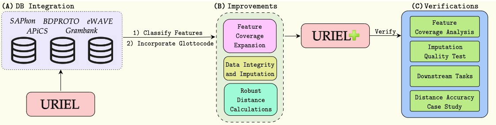

# [URIEL+: Enhancing Linguistic Inclusion and Usability in a Typological and Multilingual Knowledge Base](https://arxiv.org/abs/2409.18472)



URIEL is a knowledge base offering geographical, phylogenetic, and typological vector representations for 7970 languages. It includes distance measures between these vectors for 4005 languages, which are accessible via the lang2vec tool. Despite being frequently cited, URIEL is limited in terms of linguistic inclusion and overall usability. To tackle these challenges, we introduce URIEL+, an enhanced version of URIEL and lang2vec addressing these limitations. In addition to expanding typological feature coverage for 2898 languages, URIEL+ improves user experience with robust, customizable distance calculations to better suit the needs of the users. These upgrades also offer competitive performance on downstream tasks and provide distances that better align with linguistic distance studies.

If you are interested for more information, check out our [full paper](https://arxiv.org/abs/2409.18472).

## Contents

+ [Environment](#environment)
+ [Setup Instruction](#setup-instruction)
+ [Database Integration Examples](#database-integration-examples)
+ [Imputation Examples](#imputation-examples)
+ [Language Distance Calculation Examples](#language-distance-calculation-examples)
+ [Citation](#citation)

## Environment

Python 3.10.4 or higher. Details of dependencies are in `requirements.txt`.

## Setup Instruction

To get started with URIEL+:
    ```python
    import lang2vec.URIELPlus as uriel

    u = uriel.URIELPlus()
    ```

## Database Integration Examples

+ Integrating One Database:
    ```python
    u.integrate_{database}()
    ```
+ Integrating Some Databases:
    ```python
    u.integrate_custom_databases({databases})
    ```
+ Integrating All Databases:
    ```python
    u.integrate_databases()
    ```
+ Set Language Codes to Glottocodes:
    ```python
    u.set_glottocodes()
    ```
+ Restore the URIEL Knowledge Base:
    ```python
    u.set_uriel()
    ```

+ Replace `{database}` with `saphon`, `bdproto`, `grambank`, `apics`, or `ewave`.
+ Replace `{databases}` with arguments `UPDATED_SAPHON`, `BDPROTO`, `GRAMBANK`, `APICS`, and/or `EWAVE` (e.g., "UPDATED_SAPHON", "BDPROTO", "EWAVE").

## Imputation Examples

+ Aggregate Typological Data:
    ```python
    u.set_aggregation({aggregation}) 
    u.aggregate()
    ```

+ Impute Missing Values:
    ```python
    u.{imputation_strategy}_imputation()
    ```

+ Replace `{aggregation}` with `U` (union) or `A` (average).
+ Replace `{imputation_strategy}` with `midaspy`, `knn`, `softimpute`, or `mean`.
+ Note: the default aggregation method is union.

## Language Distance Calculation Examples

+ Calculate a Specific Distance:
    ```python
    print(u.new_distance({distance_type}, {languages}))
    ```

+ Calculate Distance Using Specific Features:
    ```python
    print(u.new_custom_distance({features}, {languages}, {source}))
    ```

+ Retrieve Language Vectors:
    ```python
    u.get_vector({distance_type}, {languages})
    ```

+ View URIEL+ Feature Coverage:
    ```python
    u.feature_coverage()
    ```

+ Calculate Confidence Scores for Distances
    ```python
    print(u.confidence_score({language 1}, {language 2}, {distance_type}))
    ```

+ Replace `{distance_type}` with a distance type (e.g., "featural") or a list (e.g., ["syntactic", "phonological"]). Must be single distance type for retrieving language vectors.
+ Replace `{features}` with a list of features (e.g., ["F_Germanic", "S_SVO", "P_NASAL_VOWELS"]).
+ Replace `{languages}`, `{language1}`, and `{language2}` with language codes (e.g., "stan1293", "hind1269").
+ Replace `{source}` with one database (e.g., "WALS") or all databases ('A').
+ Note: the default source is all databases.

## Citation

<u>If you use this code for your research, please cite the following work:</u>

```bibtex
@article{khan2024urielplus,
  title={URIEL+: Enhancing Linguistic Inclusion and Usability in a Typological and Multilingual Knowledge Base},
  author={Khan, Aditya and Shipton, Mason and Anugraha, David and Duan, Kaiyao and Hoang, Phuong H. and Khiu, Eric and Doğruöz, A. Seza and Lee, En-Shiun Annie},
  journal={arXiv preprint arXiv:2409.18472},
  year={2024}
}
```

If you have any questions, you can open a [GitHub Issue](https://github.com/Masonshipton25/URIELPlus/issues) or send us an [email](mailto:masonshipton25@gmail.com).